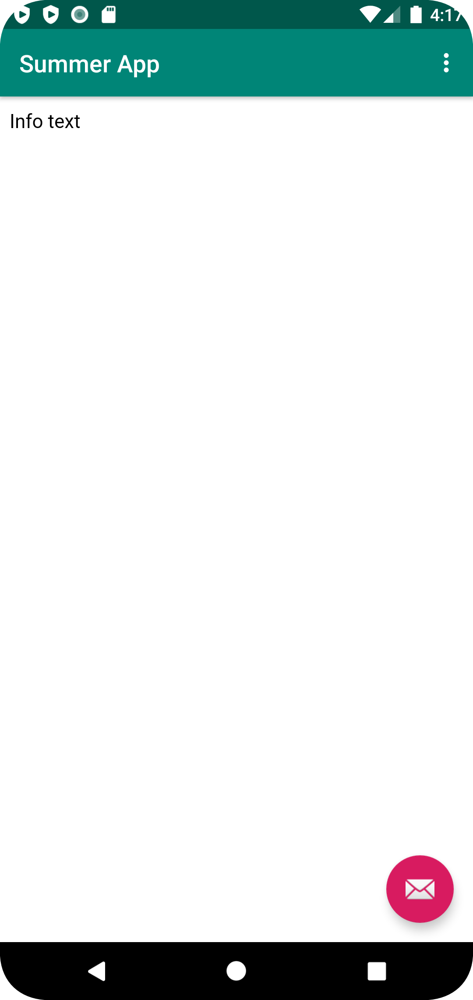

# Rapport

Jag har ändrat appens namn, detta gjorde jag genom att gå in i filen strings.xml och sedan ändra namnet under app_name.
För att ge appen tillgång till internet så gick jag in i filen AndroidManifest.xml och la till en uses-permission.

Sedan bytte jag ut TextView i filen content_main.xml till en WebView och gav den ett id.

Därefter så skapade jag en variabel av typen WebView som jag gav namnet myWebView, detta i filen MainActivity.java.
I samma fil så skapade jag sedan en url till en extern webbsida. För att sidan ska öppnas i appen när man klickar på den så
skapade jag en WebViewClient och fäster denna till WebView.

```
WebView myWebView;

```

```
  myWebView = findViewById(R.id.web_view);
```

För att skapa en så kallas intern webbsida så började jag med att skapa en ny mapp kallad assets och sedan en html fil, denna filen
döpte jag till info.html. Efter detta så la jag till url:n till denna sidan i MainActivity.java.

I appen finns tre punkter längst upp till höger, som är en så kallad dropdown meny. För att kunna hamna på de två sidor som lagts
till genom att klicka i dropdown meny på 'External Web Page' respektive 'Internal Web Page', så la jag till
`showExternalWebPage()` and `showInternalWebPage()` i MainAcitivity. java filen.


```
    public void showExternalWebPage(){
        myWebView.loadUrl("https://his.se");
    }

    public void showInternalWebPage(){
        myWebView.loadUrl("file:///android_asset/info.html");
    }
```


Den externa webbsidan:


Den interna webbsidan;


Läs gärna:

- Boulos, M.N.K., Warren, J., Gong, J. & Yue, P. (2010) Web GIS in practice VIII: HTML5 and the canvas element for interactive online mapping. International journal of health geographics 9, 14. Shin, Y. &
- Wunsche, B.C. (2013) A smartphone-based golf simulation exercise game for supporting arthritis patients. 2013 28th International Conference of Image and Vision Computing New Zealand (IVCNZ), IEEE, pp. 459–464.
- Wohlin, C., Runeson, P., Höst, M., Ohlsson, M.C., Regnell, B., Wesslén, A. (2012) Experimentation in Software Engineering, Berlin, Heidelberg: Springer Berlin Heidelberg.
